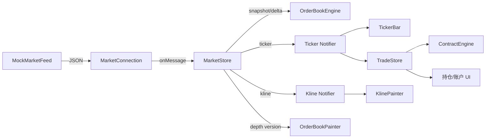
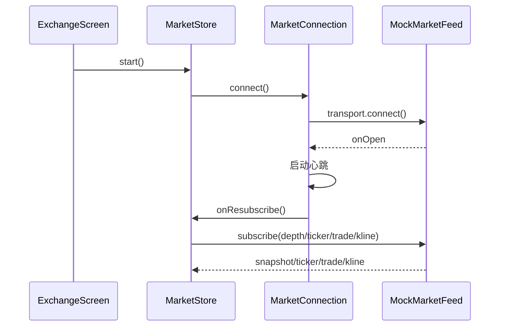
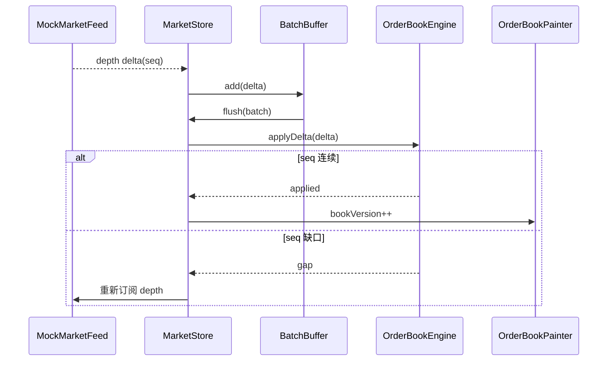
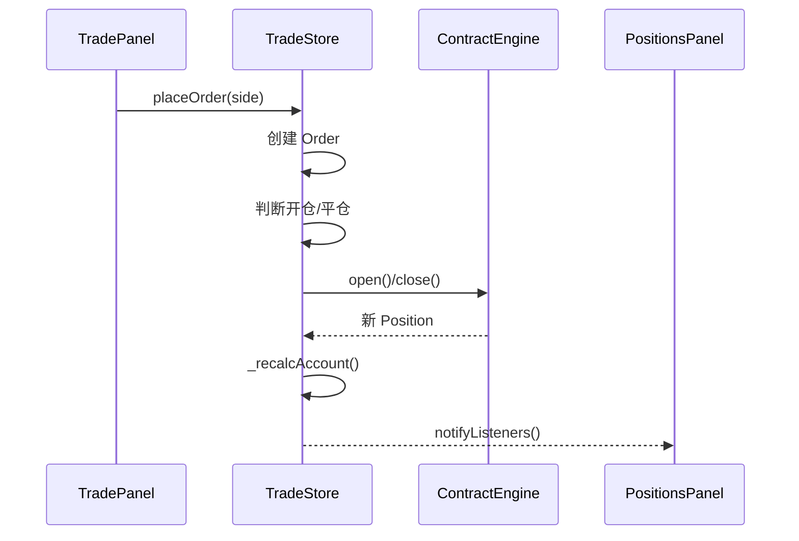
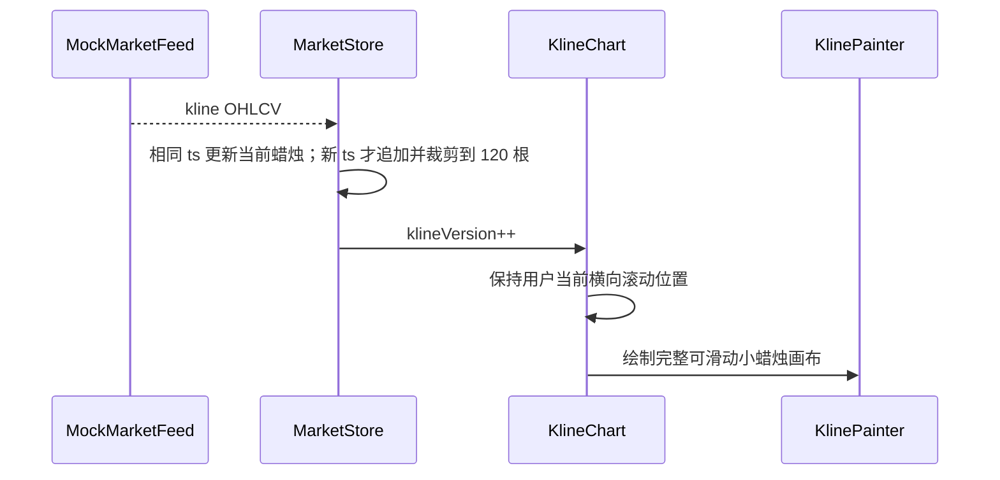

#  Exchange Flutter Demo 实现说明与 Totoro_flutter 模板对照

> 对照文件：`Totoro_flutter.html`
>
> 对应当前代码：`exchange_flutter_demo/`
>
> 文档目标：说明当前 Demo 如何把简历模板中“Bitunix 交易所 Flutter 客户端”的项目职责落到可运行代码，并明确哪些能力是完整实现、哪些是本地模拟、哪些属于后续接入真实服务时的扩展点。

---

## 1. 结论摘要

`Totoro_flutter.html` 中 Bitunix 交易所 Flutter 客户端主要描述五类能力：

1. 实时订单簿：WebSocket 快照、增量更新、Sequence 校验、Top-N 深度和高频渲染。
2. 实时行情：Ticker、Trade、Kline、Depth 多频道订阅，以及心跳、断线重连和订阅恢复。
3. 合约交易：USDT-M 永续合约，支持限价/市价、开平仓、撤单、杠杆、全仓/逐仓和 TP/SL。
4. 订单与持仓：订单、成交、持仓和账户资产状态实时同步，并更新未实现盈亏。
5. 性能优化：数据批处理、局部刷新、状态拆分和高频页面渲染优化。

当前 `exchange_flutter_demo` 对这些能力的实现情况如下：

| 模板能力 | 当前 Demo 实现 | 实现状态 |
| --- | --- | --- |
| WebSocket 多频道订阅 | `MarketConnection` + `MockMarketFeed`，订阅 depth/ticker/trade/kline | 完整模拟 |
| 心跳与 pong 超时 | `_startHeartbeat` 定时 ping，超时进入重连 | 完整模拟 |
| 断线重连与订阅恢复 | 指数退避、随机抖动、`onResubscribe` | 完整模拟 |
| 深度快照与增量 | `OrderBookEngine.applySnapshot/applyDelta` | 完整实现 |
| Sequence 校验 | stale、gap、needSnapshot 三类结果 | 完整实现 |
| Top-N 与价格聚合 | SplayTreeMap + tickSize 聚合 | 完整实现 |
| 订单簿高频渲染 | `bookVersion` + `RepaintBoundary` + CustomPainter | 完整实现 |
| Ticker、成交、K 线行情 | `MarketStore` 分发并缓存数据 | 完整模拟 |
| K 线图表 | 15分/1时/4时/1日/1月周期、手动横向滑动、自绘小蜡烛 | 完整实现 |
| USDT-M 合约计算 | 开平仓、均价、盈亏、保证金、强平价 | 公式级实现 |
| 限价/市价下单 | `TradeStore.placeOrder` | Demo 实现 |
| 杠杆、全仓/逐仓、TP/SL | 下单模型和 UI 参数已接入 | Demo 实现 |
| 撤单 | `TradeStore.cancelOrder` 已存在 | 逻辑存在，UI 未提供按钮 |
| 服务端订单状态同步 | 当前订单直接模拟为 `FILLED` | 未接真实服务 |
| 服务端账户与持仓推送 | 当前由本地 `TradeStore` 更新 | 未接真实服务 |
| 数据批处理与状态拆分 | BatchBuffer + 独立 ValueNotifier | 完整实现 |
| 移动端/桌面响应式布局 | 900px 断点切换 | 完整实现 |

一句话总结：

> 当前 Demo 重点复现了交易所客户端的“行情协议处理、订单簿本地账本、合约结算模型和 Flutter 高频渲染策略”，外部网络与撮合结果使用本地 Mock 替代，因此无需后端即可运行，但不会伪装成真实可下单的生产客户端。

---

## 2. 模板中的交易所项目原文职责

`Totoro_flutter.html` 中 Bitunix 项目描述位于项目经历部分，核心表述如下：

### 2.1 项目描述

Bitunix 交易所客户端面向数字资产交易场景，提供：

- 实时行情
- 深度订单簿
- USDT-M 永续合约交易
- 行情查看
- 下单
- 订单和持仓管理

客户端采用 Flutter 覆盖 iOS/Android，通过 WebSocket 同步行情与账户状态。

### 2.2 五条项目职责

#### 实时订单簿

基于 WebSocket 实现 Snapshot + Incremental Update 行情处理，通过 Sequence 校验维护本地 Order Book，支持 Top-N 深度数据实时更新及高频渲染。

#### 实时行情

实现 Ticker、Trade、Kline、Depth 多频道行情订阅，设计 WebSocket 连接管理、心跳检测、断线重连及订阅恢复机制。

#### 合约交易

负责 USDT-M 永续合约交易模块，支持限价/市价下单、开平仓、撤单、杠杆调整、全仓/逐仓及 TP/SL 等核心交易功能。

#### 订单与持仓

建立订单、成交、持仓及账户资产的状态实时同步机制，通过 WebSocket 推送实现交易状态与未实现盈亏实时更新。

#### 性能优化

针对高频行情优化 Flutter UI 更新机制，通过数据批处理、局部刷新及状态拆分降低无效 rebuild，提升复杂交易页面的流畅性和稳定性。

---

## 3. 当前代码总体架构

当前工程采用“Core 纯逻辑 + App 状态层 + Flutter UI”的三层结构。

```text
exchange_flutter_demo/
├── lib/
│   ├── main.dart
│   ├── core/
│   │   ├── models.dart
│   │   ├── order_book_engine.dart
│   │   ├── contract_engine.dart
│   │   ├── ws_connection.dart
│   │   ├── market_feed.dart
│   │   └── throttle.dart
│   └── app/
│       ├── exchange_screen.dart
│       ├── market_store.dart
│       ├── trade_store.dart
│       ├── order_book_painter.dart
│       └── kline_painter.dart
├── tool/
│   └── verify.dart
└── test/
    └── widget_test.dart
```

### 3.1 Core 层

Core 层只处理协议、模型和数学逻辑，不依赖 Flutter：

- `models.dart`
  定义 Ticker、Trade、Kline、Order、Position、Account、OrderBookLevel。
- `order_book_engine.dart`
  本地订单簿，处理快照、增量、Sequence 校验、Top-N 和价格聚合。
- `contract_engine.dart`
  合约结算，处理开仓、平仓、均价、盈亏、保证金和强平价。
- `ws_connection.dart`
  连接生命周期、心跳、重连和订阅恢复。
- `market_feed.dart`
  模拟交易所服务端，生成 depth/ticker/trade/kline 消息。
- `throttle.dart`
  高频消息批处理与节流工具。

### 3.2 App 层

App 层是业务状态和 UI 适配层：

- `market_store.dart`
  消费行情消息，维护订单簿、Ticker、K 线和连接状态。
- `trade_store.dart`
  维护订单、持仓和账户资产，调用合约计算引擎。
- `exchange_screen.dart`
  组织整个交易所页面并处理响应式布局。
- `order_book_painter.dart`
  绘制盘口深度。
- `kline_painter.dart`
  绘制蜡烛图和最新价。

### 3.3 Tool/Test 层

- `tool/verify.dart`
  纯 Dart 验证核心计算和异步连接链路。
- `test/widget_test.dart`
  验证窄屏与宽屏页面可以正常渲染。

### 3.4 整体数据流



---

## 4. 模块实现说明

## 4.1 应用入口：`lib/main.dart`

### 模块职责

初始化 Flutter App，配置 Material 3 主题，并把 `ExchangeScreen` 设置为默认首页。

### 当前实现

`main()` 直接执行：

```dart
runApp(const ExchangeApp());
```

`ExchangeApp` 负责：

- 设置 `MaterialApp`
- 设置主题种子色
- 开启 Material 3
- 设置 Slider 数值提示
- 关闭 Debug 横幅
- 将 `ExchangeScreen` 设置为 home

### 与模板的对应关系

模板强调 Flutter 跨平台客户端。当前代码不依赖 iOS/Android 原生能力，因此同一个 `ExchangeScreen` 可以运行在 iOS、Android、Web 和桌面 Flutter 环境。

---

## 4.2 数据模型：`lib/core/models.dart`

### 模块职责

定义跨模块共享的强类型数据，避免 UI、订单簿、连接层直接操作原始 Map。

### 主要模型

| 模型 | 作用 |
| --- | --- |
| `OrderSide` | buy/sell，表示买入或卖出方向 |
| `OrderType` | limit/market |
| `MarginMode` | cross/isolated |
| `OrderBookLevel` | 一个价格档位和数量 |
| `Ticker` | 最新价、24h 涨跌、高低点和成交量 |
| `Trade` | 逐笔成交 |
| `Kline` | OHLCV |
| `Order` | 委托单参数和状态 |
| `Position` | 持仓方向、数量、均价、杠杆和保证金模式 |
| `Account` | 权益、可用、保证金和未实现盈亏 |

### 关键设计

`Position.size` 使用正负数表示方向：

```text
size > 0  -> 多仓
size < 0  -> 空仓
```

`Position.copyWith` 让持仓在加减仓后保持不可变替换语义，减少共享对象被意外修改的风险。

---

## 4.3 订单簿引擎：`lib/core/order_book_engine.dart`

### 模块职责

维护客户端本地订单簿，把交易所的深度快照和增量消息合并成稳定的 Top-N 买卖盘。

### 核心数据结构

```dart
SplayTreeMap<double, double> _bids;
SplayTreeMap<double, double> _asks;
```

买盘使用降序比较器，卖盘使用升序比较器。这样：

- `bids.first` 永远是最优买价
- `asks.first` 永远是最优卖价
- 插入、删除和取 Top-N 不需要每次全量排序

### 快照处理

`applySnapshot`：

1. 清空本地买卖盘。
2. 遍历 snapshot.bids。
3. 遍历 snapshot.asks。
4. 忽略 size <= 0 的异常档位。
5. 将 `_lastSeq` 更新为快照序号。

快照代表服务端的权威状态，因此一旦收到快照，必须覆盖本地旧数据。

### 增量处理

`applyDelta` 先做 Sequence 校验：

```text
delta.seq <= lastSeq
    -> stale，丢弃重复或过期消息

delta.seq == lastSeq + 1
    -> applied，应用增量

delta.seq > lastSeq + 1
    -> gap，通知上层重新订阅深度

lastSeq == null
    -> needSnapshot，尚无快照，不能应用增量
```

校验通过后：

```dart
_mergeSide(_bids, delta.bids);
_mergeSide(_asks, delta.asks);
_lastSeq = delta.seq;
```

`_mergeSide` 规则：

```text
size > 0  -> upsert
size <= 0 -> 删除价格档位
```

### Top-N 与聚合

`topBids/topAsks` 直接从有序 Map 中取前 N 档。

`aggregatedTopBids` 使用 `floor` 聚合，`aggregatedTopAsks` 使用 `ceil` 聚合，确保聚合后的价格边界和可交易 tick 一致。

### 与模板职责的对应关系

这一模块完整对应模板中的：

> 基于 WebSocket 实现 Snapshot + Incremental Update 行情处理，通过 Sequence 校验维护本地 Order Book，支持 Top-N 深度数据实时更新。

---

## 4.4 WebSocket 连接管理：`lib/core/ws_connection.dart`

### 模块职责

把底层传输和业务协议解耦，统一处理：

- 连接状态
- 心跳
- pong 超时
- 断线
- 指数退避
- 重连
- 订阅恢复

### `Transport` 抽象

当前代码没有直接把 `WebSocketChannel` 写进 Store，而是先定义：

```dart
abstract class Transport {
  void connect();
  void send(String data);
  void close();

  void Function()? onOpen;
  void Function(String data)? onMessage;
  void Function(Object error)? onError;
  void Function()? onClose;
}
```

这样带来的好处：

- Demo 可以使用 `MockMarketFeed`
- 生产环境可以替换成 `web_socket_channel`
- 连接管理逻辑可以独立测试
- UI 不关心底层网络库

### 连接状态

```text
idle
  -> connecting
  -> connected
  -> reconnecting
  -> connected
  -> closed
```

### 心跳实现

连接成功后调用 `_startHeartbeat()`：

1. 每 5 秒发送 `{"op":"ping"}`。
2. 发送 ping 后开启 3 秒 pong 超时。
3. 收到 pong 时取消超时。
4. 超时仍未收到 pong 时执行 `_scheduleReconnect()`。

核心思想是不仅检测 socket close，还检测“连接还在但服务端已经假死”的情况。

### 重连实现

`_scheduleReconnect` 使用：

```text
delay = min(base * 2^(attempt - 1), maxDelay) + randomJitter
```

其中：

- `base` 是初始退避时间。
- `maxDelay` 是最大等待时间。
- `randomJitter` 防止大量客户端同时重连形成惊群。

### 订阅恢复

连接成功后：

```dart
onResubscribe?.call();
```

`MarketStore` 在此回调中重新发送：

```json
{
  "op": "subscribe",
  "channels": ["depth", "ticker", "trade", "kline"]
}
```

### 与模板职责的对应关系

这一模块完整对应模板中的：

> 设计 WebSocket 连接管理、心跳检测、断线重连及订阅恢复机制。

---

## 4.5 模拟行情服务端：`lib/core/market_feed.dart`

### 模块职责

在没有真实交易所服务的情况下，模拟服务端行为，保证 Demo 启动后立即有数据。

### 支持的频道

- depth
- ticker
- trade
- kline

### 深度行为

`_sendSnapshot()`：

- 每次订阅 depth 都生成一份完整快照。
- seq 递增。
- 买卖盘包含 40 个价格档位。

`_sendDelta()`：

- 每次随机修改 1~3 个档位。
- 每 `gapEvery` 条消息主动跳过 seq。
- 用缺口验证客户端的 gap 检测与重订阅。

### 心跳行为

收到：

```json
{"op":"ping"}
```

后返回：

```text
pong
```

### 断线行为

`dropAfter` 时间到达后：

1. 停止行情定时器。
2. 触发 `onClose`。
3. `MarketConnection` 进入重连流程。

### K 线行为

订阅 K 线或切换周期时，`_sendKlineHistory()` 会按照当前周期补发 120 根历史蜡烛。

实时阶段大多数消息只更新当前蜡烛，达到模拟周期边界后才追加一根新 K 线：

- open 使用上一价格
- close 使用随机波动后的新价格
- high/low 自动补齐影线
- 保证 open、high、low、close 满足 OHLC 关系

### 与模板职责的对应关系

Mock 不是替代真实交易所，而是用于验证：

- 多频道订阅协议
- 快照与增量处理
- Sequence 缺口
- 心跳
- 断线重连
- 订阅恢复

---

## 4.6 行情状态仓库：`lib/app/market_store.dart`

### 模块职责

`MarketStore` 是行情协议和 UI 之间的适配层。

它负责：

- 启动 MarketConnection
- 发送订阅
- 解析 JSON
- 分发 depth/ticker/trade/kline
- 维护订单簿
- 暴露连接状态
- 控制刷新粒度

### 刷新通道拆分

#### 订单簿

```dart
ValueNotifier<int> bookVersion;
```

只有真正应用了订单簿增量后才 `bookVersion.value++`。

订单簿 UI 订阅这个版本号，不订阅整个 MarketStore。

#### Ticker

```dart
ValueNotifier<Ticker?> tickerNotifier;
```

只刷新顶部行情栏。

#### K 线

```dart
ValueNotifier<int> klineVersion;
ValueNotifier<KlineInterval> klineIntervalNotifier;
```

`klineVersion` 只刷新 K 线图表；周期选择器通过 `klineIntervalNotifier` 驱动周期切换。
收到相同时间戳的 K 线时只替换最后一根蜡烛，不持续追加新数据。

#### 连接状态

连接状态使用 `ChangeNotifier`：

```dart
connState = s;
notifyListeners();
```

AppBar 的连接标签只订阅这个状态。

### 深度消息处理

收到快照：

```text
_depthBuffer.clear()
book.applySnapshot(...)
bookVersion.value++
```

收到增量：

```text
_depthBuffer.add(...)
100ms 后统一 applyDelta
```

处理增量时：

- `applied` 表示状态发生变化。
- `gap` 表示序号不连续，立即重新订阅 depth。
- `stale` 和 `needSnapshot` 不触发 UI 刷新。

### K 线处理

K 线列表最多保留 120 根：

```dart
klines.add(...);
if (klines.length > 120) {
  klines.removeAt(0);
}
klineVersion.value++;
```

### 与模板职责的对应关系

这一模块同时承担模板中的：

- Ticker/Trade/Kline/Depth 多频道订阅
- 快照和增量处理
- 数据批处理
- 状态拆分
- 高频 UI 刷新控制

---

## 4.7 订单簿绘制：`lib/app/order_book_painter.dart`

### 模块职责

用 CustomPainter 绘制交易所盘口，而不是创建几十个 Text/Container Widget。

### 绘制顺序

```text
卖盘（高 -> 低）
中间价与价差
买盘（高 -> 低）
```

这样最优卖价和最优买价都会靠近中间区域，符合交易所盘口阅读习惯。

### 累计深度条

每档先累计：

```text
cumulativeSize += currentSize
```

然后用：

```text
cumulativeSize / maxCumulativeSize
```

计算背景条宽度。

盘口行包含：

- 价格
- 数量
- 半透明深度背景

### 局部刷新

`OrderBookPainter.shouldRepaint`：

```dart
oldDelegate.version != version
```

版本没变化时不重绘。

外层再接：

```dart
RepaintBoundary
```

将高频盘口绘制与其他 UI 图层隔离。

### 与模板职责的对应关系

对应模板中的：

> Top-N 深度数据实时更新及高频渲染。

---

## 4.8 K 线绘制：`lib/app/kline_painter.dart`

### 模块职责

不引入第三方图表库，直接绘制小蜡烛图。

### 绘制流程

1. 找出可见 K 线 high/low。
2. 增加上下价格留白。
3. 绘制水平价格网格和纵向网格。
4. 把价格转换为 Y 坐标。
5. 绘制 high-low 影线。
6. 绘制 open-close 实体。
7. 绘制最新价虚线。
8. 绘制右侧最新价标签。

### 蜡烛样式

- 红绿判断：`close >= open` 为上涨色，否则为下跌色。
- 实体宽度：`slot * 0.62`
- 最大宽度：7.2px
- 最小宽度：1.6px
- 使用圆角矩形。
- 开盘价和收盘价重合时保留 1.4px 的最小实体高度。

### 周期选择

工具栏提供：

```text
15分 / 1时 / 4时 / 1日 / 1月
```

周期由 `KlineInterval` 统一定义。切换周期后：

1. 清空旧周期 K 线。
2. 向 Mock WebSocket 重新订阅 K 线。
3. 服务端按新周期发送 120 根历史数据。
4. 图表自动定位到最新一段，之后不再自动追随。

### 固定视窗与手动滑动

图表为当前周期加载的完整历史数据创建固定宽度的可滚动画布：

```text
内容宽度 = 蜡烛数量 * 单根槽位宽度
```

外层使用横向 `SingleChildScrollView` 和 `Scrollbar`。用户手动拖动或滑动查看历史；
实时更新不会把当前视窗自动拉回最右侧。

### 当前蜡烛更新

MarketStore 发现服务端 K 线的 `ts` 与最后一根相同时，只替换最后一根 OHLCV：

```dart
klines[klines.length - 1] = kline;
```

只有周期结束、时间戳变化时才追加新蜡烛，因此价格走势不会一直滚动。

### 最新价

使用最近一根 K 线的 close：

- 绘制横向虚线
- 在右侧价格轴显示深色价格标签

### 与模板职责的对应关系

模板中存在 Kline 行情频道，但未限定图表实现。当前代码额外实现了轻量自绘蜡烛图，用来展示 Flutter CustomPainter 与高频刷新能力。

---

## 4.9 合约计算引擎：`lib/core/contract_engine.dart`

### 模块职责

提供纯数学的 USDT-M 永续合约计算，不依赖 Flutter。

### 未实现盈亏

多仓：

```text
(markPrice - entryPrice) * size
```

空仓：

```text
(entryPrice - markPrice) * abs(size)
```

### 开仓与加仓

同向加仓时计算加权平均开仓价：

```text
newAvg = (oldQty * oldPrice + newQty * newPrice) / (oldQty + newQty)
```

### 平仓与已实现盈亏

平多：

```text
(closePrice - entryPrice) * closeQty
```

平空：

```text
(entryPrice - closePrice) * closeQty
```

平仓数量超过持仓时按全部持仓处理。

### 初始保证金

```text
initialMargin = positionSize * markPrice / leverage
```

### 强平价

当前使用简化近似公式：

```text
long:  entry * (1 - 1 / leverage + maintenanceMarginRate)
short: entry * (1 + 1 / leverage - maintenanceMarginRate)
```

### 简化边界

真实交易所的强平价还会受以下因素影响：

- 维持保证金梯度
- 资金费率
- 标记价
- 风险限额
- 全仓账户其他仓位
- 保险基金和自动减仓规则

因此当前公式用于 Demo 展示和公式演示，不应直接用于真实交易。

---

## 4.10 交易状态仓库：`lib/app/trade_store.dart`

### 模块职责

管理：

- 订单
- 持仓
- 保证金
- 可用余额
- 未实现盈亏
- 当前下单参数

### 下单流程

```text
placeOrder
  -> 创建 Order
  -> 判断是开仓还是平仓
  -> 计算成交价
  -> ContractEngine 更新持仓
  -> 重新计算账户
  -> notifyListeners
```

### 成交价

```text
限价单 -> 使用输入价格
市价单 -> 使用 markPrice
```

### 开仓和平仓判断

- 买入订单遇到空仓：平空
- 卖出订单遇到多仓：平多
- `reduceOnly=true`：强制走平仓逻辑
- 没有反向仓位：开仓

### 账户重算

```text
margin = sum(每个持仓的 initialMargin)
unrealizedPnl = sum(每个持仓的 unrealizedPnl)
available = initialBalance - margin + unrealizedPnl
```

### Demo 边界

当前：

- 下单后直接标记为 `FILLED`
- 没有真实撮合回报
- 没有订单推送频道
- `cancelOrder` 逻辑存在，但订单面板没有撤单按钮
- 没有真实账户频道

真实项目中应改为：

```text
交易请求
  -> 交易网关
  -> 撮合引擎
  -> 订单私有 WebSocket 推送
  -> TradeStore 对账并更新状态
```

### 与模板职责的对应关系

对应：

- 限价/市价下单
- 开平仓
- 杠杆
- 全仓/逐仓
- TP/SL
- 订单、持仓、账户资产和未实现盈亏展示

撤单与服务端状态同步属于“逻辑能力已预留、真实服务未接入”的部分。

---

## 4.11 页面与响应式布局：`lib/app/exchange_screen.dart`

### 模块职责

组织交易所单页工作台：

- 顶部行情
- K 线
- 订单簿
- 下单
- 持仓
- 订单
- WebSocket 连接状态

### 宽屏布局

宽度 >= 900：

```text
TickerBar
KlineChart
Row
├── OrderBookPanel
└── TradingWorkspace
    ├── 下单
    ├── 持仓
    └── 订单
```

特点：

- 盘口与交易区并排
- 图表高度根据窗口高度自适应
- 盘口宽度限制在合理范围

### 窄屏布局

宽度 < 900：

```text
ListView
├── TickerBar
├── KlineChart
├── OrderBookPanel
└── TradingWorkspace
```

特点：

- 不再强行横向并排
- 避免盘口和交易面板溢出
- 保持移动端纵向滚动体验

### 键盘收起

页面 body 外层使用：

```dart
GestureDetector(
  behavior: HitTestBehavior.translucent,
  onTap: () => FocusScope.of(context).unfocus(),
  child: SafeArea(...),
)
```

点击空白区域即可收起键盘。

### 页面状态原则

Widget 不直接保存行情或订单业务状态，只：

- 读取 Store
- 构建 UI
- 收集输入
- 调用 Store 方法

---

## 4.12 高频缓冲：`lib/core/throttle.dart`

### `BatchBuffer`

用途：

- 不丢消息
- 窗口内合并
- 窗口到期一次性回调

当前深度增量：

```text
到达间隔：约 25ms
批处理窗口：100ms
```

效果：

```text
约 4 条增量合并为一次 applyDelta + 一次 UI 刷新
```

### `Throttler`

用于只关心最新值的场景。

特点：

- 固定周期内只放行一次
- 中间触发合并为 pending
- 不保证每条消息都被处理

### 与模板职责的对应关系

对应：

> 数据批处理、局部刷新及状态拆分降低无效 rebuild。

---

## 5. 关键业务链路

## 5.1 行情连接链路



## 5.2 深度增量链路



## 5.3 合约下单链路



## 5.4 K 线链路



---

## 6. 性能设计对照

| 优化点 | 当前实现 | 解决的问题 |
| --- | --- | --- |
| 数据批处理 | `BatchBuffer` 100ms 合并深度增量 | 避免每条 25ms 消息都触发 UI 刷新 |
| 订单簿局部刷新 | `bookVersion` + `shouldRepaint` | 盘口未变化时不重绘 |
| RepaintBoundary | 包裹订单簿 CustomPaint | 隔离高频盘口与其他区域 |
| Ticker 独立通知 | `ValueNotifier<Ticker?>` | 只刷新行情栏 |
| K 线独立通知 | `ValueNotifier<int> klineVersion` | 只刷新图表 |
| 连接状态独立 | ChangeNotifier + connState | AppBar 状态单独刷新 |
| 交易状态独立 | TradeStore | 行情刷新不触发交易面板重建 |
| K 线手动滑动 | 固定蜡烛槽位 + 横向 ScrollView | 用户自己查看历史，避免图表持续滚动 |
| Core/UI 分层 | core 不依赖 Flutter | 纯逻辑可快速验证和复用 |

---

## 7. 当前实现与模板的差异和边界

## 7.1 已完整复现的能力

- Snapshot + Incremental Update
- Sequence 校验
- 本地订单簿
- Top-N 深度
- Ticker/Trade/Kline/Depth 多频道
- 心跳探测
- 指数退避重连
- 订阅恢复
- 合约盈亏、保证金和强平价计算
- 下单与持仓 UI
- 数据批处理
- 局部刷新
- 状态拆分
- 响应式布局
- K 线小蜡烛自绘

## 7.2 使用 Mock 的能力

- WebSocket 网络连接
- 服务端深度快照和增量
- 服务端主动断线
- Ticker/Trade/Kline 推送
- 市价和限价成交

## 7.3 尚未接入真实生产服务的能力

- 真实 WebSocket 地址和鉴权
- 真实交易 REST/WebSocket API
- 服务端订单状态推送
- 服务端成交回报
- 服务端持仓和账户频道
- 撤单 UI 和撤单确认
- 订单部分成交
- 多笔订单并发对账
- API 错误码、限频和重试策略
- 资金费率、维持保证金梯度和风险限额

## 7.4 为什么当前边界是合理的

因为这是一个用于演示架构和 Flutter 能力的本地 Demo：

- 不依赖后端即可运行
- 能稳定复现关键协议流程
- 不会因为真实资产或真实下单产生风险
- 代码结构保留了替换真实 Transport 和交易网关的接口边界

---

## 8. 与简历描述的映射建议

如果需要在简历或面试中描述这个 Demo，建议不要把 Mock 描述成真实生产实现，可以使用下面这种表达：

> 我实现了一个交易所 Flutter 客户端 Demo，复现 Bitunix 类交易所的核心客户端链路：使用 Snapshot + Incremental Update 和 Sequence 校验维护本地订单簿，通过 WebSocket 抽象层实现心跳、断线重连和订阅恢复，并完成 USDT-M 合约开平仓、盈亏、保证金和强平价计算。针对高频行情，使用数据批处理、独立 ValueNotifier、RepaintBoundary 和 CustomPainter 局部刷新降低无效 rebuild，同时实现了宽屏/窄屏自适应交易页面。

面试时可以重点展开：

1. 为什么订单簿不能只按消息到达顺序 apply。
2. 为什么 seq 缺口必须重新拉快照。
3. 为什么不能每条深度消息都 setState。
4. 为什么 Ticker、Kline、Depth 要使用不同刷新通道。
5. 为什么 WebSocket 需要 pong 超时，而不只是监听 onClose。
6. 指数退避加随机抖动解决什么问题。
7. 为什么开仓加仓需要加权平均价。
8. 为什么 Demo 的强平价不是生产公式。
9. CustomPainter 与大量 Widget 构建的取舍。
10. 如何把 MockMarketFeed 替换成真实 WebSocket 和生产交易 API。

---

## 9. 验证方式

### 静态分析

```bash
cd exchange_flutter_demo
dart analyze lib test
```

### 核心链路验证

```bash
cd exchange_flutter_demo
dart run tool/verify.dart
```

覆盖：

- 订单簿快照
- 连续增量
- 过期消息
- Sequence 缺口
- 多空盈亏
- 加仓均价
- 平仓结算
- 强平价
- 批处理
- 心跳
- 断线重连
- 订阅恢复

### 页面测试

```bash
cd exchange_flutter_demo
flutter test
```

覆盖：

- 390x844 窄屏
- 1280x900 宽屏
- 关键区域渲染
- RenderFlex 溢出检查

---

## 10. 后续接入真实交易所服务的建议改造顺序

### 第一步：替换 Transport

把 `MockMarketFeed` 替换为真实 WebSocket 客户端：

```text
WebSocketTransport implements Transport
```

保持 `MarketConnection` 不需要改动。

### 第二步：替换交易网关

新增：

```text
TradeGateway / OrderApi / AccountApi
```

`TradeStore.placeOrder` 不再直接标记 FILLED，而是：

```text
提交订单
  -> 等待订单推送
  -> 更新 order.status
  -> 等待成交推送
  -> 更新 position/account
```

### 第三步：增加交易私有频道

建议拆分：

- orders
- trades
- positions
- account
- risk

每个频道独立解析，再统一对账到 TradeStore。

### 第四步：加入持久化

对订单号、持仓快照和 sequence 做本地持久化：

- App 重启后可以恢复订单状态
- 断线后可以先展示上次快照
- 再通过服务端权威快照覆盖本地状态

### 第五步：补齐生产风控

- 下单前保证金校验
- 最小下单量和价格精度校验
- 限频与错误码处理
- 风险限额
- 强平预告
- 订单幂等和重复提交保护

---

## 11. 总结

当前 `exchange_flutter_demo` 不是只做“页面长得像交易所”，而是把交易所客户端的几条关键数据链路拆成可解释、可验证的模块：

- 用 `OrderBookEngine` 处理本地账本。
- 用 `MarketConnection` 管理连接生命周期。
- 用 `MarketStore` 处理协议分发和刷新粒度。
- 用 `ContractEngine` 处理合约数学。
- 用 `TradeStore` 管理订单、持仓和账户。
- 用 CustomPainter 实现高频订单簿和蜡烛图。
- 用响应式布局覆盖桌面和移动端。

这套结构的核心价值是：

> 当真实后端、真实 WebSocket 和真实交易网关接入时，可以优先替换 `Transport` 和交易网关，而不需要重写订单簿、合约计算、状态刷新和大部分页面结构。

---

## 12. Flutter 帧率与卡顿排查手册

> 这一部分用于补充 Flutter 客户端在高频行情、交易页面和线上真实用户场景中的性能排查方法。
>
> 平台能力和 Flutter 官方插件会持续更新，正式选型时应再次核对各平台当前版本的官方文档。

## 12.1 先建立正确的性能指标

排查性能不能只看“感觉卡”或平均帧率，应先区分：

- UI Thread：Dart 执行 build、layout、业务逻辑和数据转换。
- Raster Thread：GPU 提交前的绘制、图层合成和光栅化。
- Platform Thread：Flutter Engine 与原生消息循环。
- Native Main Thread：Android/iOS 原生主线程。
- IO/Worker Thread：网络、文件、数据库、解码和后台任务。

Flutter 中最重要的两个阶段是：

```text
buildDuration  -> UI 线程完成 build/layout 的时间
rasterDuration -> Raster 线程完成绘制/合成的时间
```

一帧的预算：

| 刷新率 | 单帧预算 |
| --- | --- |
| 60Hz | 约 16.67ms |
| 90Hz | 约 11.11ms |
| 120Hz | 约 8.33ms |

注意：

- 调试模式下的性能没有参考意义。
- 模拟器、低性能工程机和用户真实设备的表现可能完全不同。
- 平均帧率容易掩盖卡顿，应重点看 P90、P95、P99 和最长帧。
- 掉 1 帧、慢帧、冻结帧和 ANR 是不同等级的问题。

推荐指标：

```text
jankFrameCount
jankFrameRatio
slowFrameCount
frozenFrameCount
frameBuildP50/P90/P95/P99
frameRasterP50/P90/P95/P99
worstFrameDuration
ANR/卡死率
启动耗时
页面首次可交互时间
```

## 12.2 Flutter 中采集 FrameTiming

Flutter 可以通过 `SchedulerBinding` 或 `WidgetsBinding` 获取真实帧耗时：

```dart
WidgetsBinding.instance.addTimingsCallback((timings) {
  for (final timing in timings) {
    final buildMs = timing.buildDuration.inMicroseconds / 1000;
    final rasterMs = timing.rasterDuration.inMicroseconds / 1000;
    final totalMs = timing.totalSpan.inMicroseconds / 1000;

    // 线上不要每一帧都上报，应按窗口聚合和采样。
  }
});
```

`FrameTiming` 常用字段：

- `buildDuration`
- `rasterDuration`
- `vsyncOverhead`
- `totalSpan`

线上建议按以下维度聚合：

- App 版本
- 页面/路由
- 设备型号和芯片
- Android/iOS 版本
- 刷新率
- 网络类型
- 当前业务动作
- 是否冷启动
- 是否处于前台

不要每一帧都发送一条网络请求。推荐每个页面会话或 10～30 秒窗口聚合一次：

```text
route
frameCount
jankCount
p90Build
p95Raster
worstFrame
deviceModel
osVersion
appVersion
```

## 12.3 Debug、Profile 和 Release

性能问题必须在正确的构建模式下排查：

```bash
flutter run --profile
```

Profile 模式：

- 保留接近 Release 的编译优化。
- 可连接 DevTools。
- 适合本地性能分析。

Release 模式：

- 最接近真实用户。
- 不能再依赖 Debug 绘制和详细日志排查。
- 必须通过网络监控、FrameTiming 聚合、Trace 和日志埋点辅助定位。

Debug 模式：

- 只用于功能排查。
- 不用于判断真实帧率和卡顿。
- Debug 下的断言、JIT 和额外检查会显著放慢运行速度。

## 12.4 本地排查常用工具

| 工具 | 主要用途 |
| --- | --- |
| Flutter DevTools Performance | Frame Chart、UI/Raster 耗时、Timeline |
| Flutter DevTools CPU Profiler | Dart 函数级耗时和火焰图 |
| Flutter DevTools Memory | 内存、对象分配、泄漏排查 |
| Flutter Inspector | Widget 树、布局、重绘边界 |
| Android Studio Profiler | CPU、内存、网络、原生线程 |
| Android Perfetto/Systrace | 系统级调度、主线程、GPU、锁等待 |
| Android Studio Layout Inspector | Android 视图布局 |
| Xcode Instruments Time Profiler | iOS CPU 和调用栈 |
| Xcode Instruments Core Animation | iOS 渲染、图层和 GPU |
| Xcode Instruments Metal System Trace | Metal/GPU 渲染链路 |
| 腾讯 WeTest PerfDog | 真机帧率、CPU、GPU、温度和功耗测试 |
| 平台 APM/RUM | 线上真实用户监控和分群 |

## 12.5 Flutter DevTools 排查流程

### 第一步：连接 Profile 模式应用

```bash
flutter run --profile
flutter pub global activate devtools
flutter pub global run devtools
```

也可以直接从 `flutter run` 输出中打开 DevTools。

### 第二步：打开 Performance 页面

重点观察：

- Frame Chart 中哪些帧超过预算。
- UI 线程是否长时间高占用。
- Raster 线程是否长时间高占用。
- 构建、布局、绘制和动画事件是否集中。
- 是否出现 shader compilation、GC 或 channel 长时间等待。

### 第三步：使用 Timeline

在关键业务代码中加入 Timeline 标记：

```dart
import 'dart:developer' as developer;

developer.Timeline.timeSync('depth.applyDelta', () {
  book.applyDelta(delta);
});
```

也可以手动开始和结束：

```dart
developer.Timeline.startSync('kline.aggregate');
// 处理 K 线
developer.Timeline.finishSync();
```

建议标记：

- WebSocket 消息解析
- 订单簿合并
- K 线聚合
- 下单提交
- 页面 build
- 大列表刷新
- 图片解码
- 本地数据库读写

### 第四步：区分 UI 卡顿和 Raster 卡顿

UI 线程高：

- `setState` 范围过大。
- 每秒触发几十次 rebuild。
- build 内执行排序、格式化、计算和 JSON 解析。
- 大列表不是懒加载。
- 嵌套滚动和复杂布局。
- ChangeNotifier/AnimatedBuilder 监听范围过大。
- 同步数据库、文件或平台通道调用。

Raster 线程高：

- `Opacity`。
- `BackdropFilter`。
- 大范围 `ClipPath/ClipRRect`。
- `saveLayer`。
- 阴影、模糊和半透明叠加。
- 超大图片未 resize/decode。
- CustomPainter 每帧全量重绘。
- 图层过多或频繁创建/销毁。
- Shader 编译抖动。

### 第五步：验证优化是否有效

每次只改变一个变量：

1. 记录优化前 P50/P90/P95。
2. 修改代码。
3. 在相同设备、相同数据和相同操作下重复测试。
4. 对比 UI、Raster 和 jank ratio。
5. 对高频场景使用长时间运行测试，观察是否存在内存增长或温度降频。

## 12.6 Flutter 常见卡顿原因与解决方案

### 高频 setState

问题：

```dart
setState(() {
  orderBook = newOrderBook;
});
```

解决：

- 拆分状态。
- 使用 `ValueNotifier` 或局部 `AnimatedBuilder`。
- 只刷新真正变化的区域。
- 使用 `RepaintBoundary`。

当前交易所 Demo 已经使用：

```text
bookVersion
tickerNotifier
klineVersion
klineIntervalNotifier
```

### 高频列表整体重建

问题：

- `ListView` 外层状态变化导致整个页面 rebuild。
- 使用 `shrinkWrap: true` 包在滚动容器中。
- 使用 `Column` 渲染大量动态条目。

解决：

- 使用 `ListView.builder`。
- 避免不必要的 `shrinkWrap`。
- 使用 `itemExtent` 或 `prototypeItem`。
- 为列表项建立稳定的 Key。
- 只更新可见区域。

### build 中执行重业务

问题：

- JSON 解析。
- 大量排序。
- 日期格式化。
- 复杂指标计算。
- 本地数据库查询。

解决：

- 移到 Store 或数据层。
- 缓存中间结果。
- 大批量 JSON 和计算放到 Isolate。
- 使用 `compute` 或自己管理长期 Isolate。

### CustomPainter 全量重绘

问题：

```dart
bool shouldRepaint(...) => true;
```

解决：

- 增加 version。
- 只在数据版本变化时重绘。
- 使用 `RepaintBoundary`。
- 对局部绘制区域使用 `canvas.save/clipRect`。
- 不要在每个 painter 中重新创建大量对象。

当前订单簿和 K 线都使用 version 判断重绘。

### 图片和内存

问题：

- 解码超大原图。
- 同一图片重复解码。
- 列表滚动时创建新图片对象。
- 图片缓存无上限。

解决：

- 使用 `cacheWidth/cacheHeight`。
- 使用 `ResizeImage`。
- 优先使用 WebP/AVIF 等格式。
- 控制图片缓存。
- 用 DevTools Memory 检查对象持续增长。

### 平台通道阻塞

问题：

- 高频 MethodChannel 调用。
- 原生方法在主线程执行耗时任务。
- 每次消息都跨平台传输大对象。

解决：

- 批量调用。
- 使用 Pigeon 生成类型安全接口。
- 原生耗时任务移到后台线程。
- 只传必要字段。

### Shader 编译抖动

表现：

- 页面第一次出现某类绘制时明显卡顿。
- 后续重复操作不再卡。

解决：

- 尽量减少复杂 shader 和首次绘制。
- 预热关键页面。
- 比较 Impeller 与 Skia 表现。
- 使用 Profile 模式验证，不要以 Debug 结果为准。

## 12.7 交易所 Demo 中应重点监控的场景

针对当前 `exchange_flutter_demo`：

- 一秒内连续收到大量 depth delta。
- 订单簿 20 档每 180ms 更新。
- K 线切换周期并一次加载 120 根。
- 用户横向滑动 K 线时持续绘制。
- 持仓盈亏随 Ticker 高频变化。
- 下单、撤单、平仓操作期间页面刷新。
- 断线重连后批量快照恢复。
- 长时间运行后内存是否持续增长。
- 移动端高温降频后的帧率。

重点观察：

```text
MarketStore._onMessage
OrderBookEngine.applyDelta
KlinePainter.paint
OrderBookPainter.paint
TradeStore._recalcAccount
ExchangeScreen build
```

## 13. 线上卡顿问题如何排查定位

线上卡顿和本地 Profile 最大区别是：

- 无法直接连接用户设备。
- 设备和环境高度分散。
- 发生时间和业务操作不一致。
- 数据采样必须控制成本和隐私。

## 13.1 线上必须具备的基础能力

### 崩溃和 Dart 异常

```dart
FlutterError.onError = (details) {
  FlutterError.presentError(details);
  // 上报第三方监控平台
};

PlatformDispatcher.instance.onError = (error, stack) {
  // 上报
  return true;
};
```

### Flutter FrameTiming

使用 `WidgetsBinding.instance.addTimingsCallback` 聚合采集 UI/Raster 帧耗时。

### 页面和操作链路

每次关键页面打开、Tab 切换、网络请求、下单和平仓都记录：

- sessionId
- userId 或匿名 ID
- route
- action
- startTime
- endTime
- result
- network state
- app version
- device model

### 原生崩溃和 ANR

Android：

- Java/Kotlin crash
- Native crash
- ANR
- Tombstone

iOS：

- Objective-C/Swift crash
- Mach exception
- watchdog termination
- hang

必须上传：

- Android mapping/ProGuard/R8 文件
- iOS dSYM
- Flutter symbol 信息

## 13.2 线上需要采集的维度

不要只上报“平均 FPS”。

建议按以下维度分群：

- App 版本
- Flutter 版本
- Android/iOS 版本
- 设备型号、CPU、GPU、内存
- 屏幕刷新率
- 是否低电量模式
- 网络类型和延迟
- 页面路由
- 操作路径
- 行情更新频率
- 订单簿深度档位
- K 线周期和数量
- 启动阶段/前台/后台
- 是否发生重连
- 是否刚经历快照恢复

## 13.3 线上告警指标

建议设置：

```text
jank frame ratio > 5%
P95 UI frame > 32ms
P95 Raster frame > 32ms
frozen frame ratio > 0.1%
ANR rate 环比上升 20%
页面首次可交互时间 P95 上升 20%
特定型号卡顿率显著高于整体
```

阈值只是示例，应根据产品实际设备和交互定义。

## 13.4 线上问题定位步骤

### 第一步：确认影响范围

- 所有用户还是小部分用户？
- 新版本引入还是历史问题？
- Android、iOS 还是特定机型？
- 特定页面、网络或行情状态？
- 是否和某个功能开关同时发布？

### 第二步：比较版本和分群

比较：

- 当前版本和上一个版本。
- 灰度组和全量组。
- 高端机和低端机。
- Wi-Fi 和移动网络。
- 正常行情和高频行情。

### 第三步：定位是 UI 还是 Raster

线上监控如果能区分：

- UI 高：优先查 rebuild、JSON、计算、布局。
- Raster 高：优先查绘制、图片、透明图层、shader、CustomPainter。

如果平台不能区分，需要自己通过 FrameTiming 上报。

### 第四步：结合 Trace 和日志

查找同一 session：

- 卡顿发生前后的操作。
- 网络请求耗时。
- WebSocket 断线重连。
- 大量消息集中到达。
- GC 或内存高峰。
- 原生线程阻塞。

### 第五步：本地复现

根据线上信息构造相同条件：

- 相同设备级别。
- 相同行情更新频率。
- 相同订单簿档位。
- 相同 K 线数量。
- 相同网络延迟和抖动。
- 相同页面停留时间。

然后使用 Profile 模式、DevTools、Perfetto 或 Instruments 复现。

### 第六步：修复并验证

验证方式：

- 灰度版本对比。
- 线上 P95 指标对比。
- 同设备性能测试对比。
- 长时间运行和高温降频测试。
- 关闭功能开关对比。

## 13.5 Android 线上/线下定位工具

- Android Studio Profiler
- Perfetto
- Systrace
- `adb shell dumpsys gfxinfo <package> framestats`
- Android Studio Layout Inspector
- simpleperf
- Google Play Android Vitals
- Firebase Crashlytics
- Android Studio CPU/Memory/Network Profiler

常用命令：

```bash
adb shell dumpsys gfxinfo com.example.app framestats
adb shell dumpsys gfxinfo com.example.app reset
```

Perfetto/Systrace 适合分析：

- 主线程阻塞
- Binder 调用
- GPU 提交
- 锁竞争
- 调度延迟
- RenderThread 耗时

## 13.6 iOS 线上/线下定位工具

- Xcode Organizer
- Xcode Instruments Time Profiler
- Core Animation
- Metal System Trace
- MetricKit
- Firebase Crashlytics
- Sentry/MetricKit 自定义事件

MetricKit 可提供：

- Hang 指标
- CPU 异常
- 电量
- 启动
- 内存
- 磁盘写入

## 13.7 线上问题缓解策略

如果短时间无法定位：

1. 关闭相关实验开关。
2. 降低行情刷新频率。
3. 降低订单簿档位或减少可见 K 线数量。
4. 临时降级动画和模糊效果。
5. 对高频数据增加采样。
6. 灰度回滚。
7. 服务端减少推送频率或合并消息。
8. 强制用户更新到修复版本。

---

## 14. 第三方性能监控平台

## 14.1 海外平台

| 平台 | 主要能力 | Flutter 接入关注点 |
| --- | --- | --- |
| Firebase Crashlytics | Crash、非致命错误、版本分群 | Flutter 官方 Crashlytics 插件成熟；性能监控需另外接入 Performance |
| Firebase Performance Monitoring | 启动、网络、Trace、自定义指标 | 有 Flutter 插件；Dart UI/Raster 帧耗时通常需要自定义上报 |
| Sentry | 错误、Trace、性能、Session、帧指标 | Flutter SDK 官方支持；不同套餐的性能和 Profiling 能力不同 |
| Datadog RUM/Mobile | RUM、Crash、ANR、网络、Trace、Logs | 有 Flutter SDK；适合已使用 Datadog 全栈观测的团队 |
| New Relic Mobile | Crash、网络、交互、移动 APM | 有移动 Agent；Flutter 支持程度以当前官方插件为准 |
| Dynatrace | 数字体验、移动 APM、端到端 Trace | 有移动 Agent/Flutter 插件；企业级能力较强 |
| Embrace | 移动用户体验、Crash、ANR、Session、性能 | Flutter 支持较好，关注真实用户会话和性能 |
| Instabug | Crash、APM、用户反馈、Session Replay | 有 Flutter SDK，适合需要用户反馈闭环的产品 |
| Bugsnag (SmartBear) | Crash、错误、Release Health | 有 Flutter SDK；重点是稳定性和错误，不是完整 UI 帧分析 |
| Raygun | Crash、错误、Real User Monitoring | 有 Flutter 相关 SDK，接入前确认当前维护状态 |
| Countly | 产品分析、Crash、性能、Push | 有 Flutter SDK；性能和产品分析能力随版本变化 |
| OpenTelemetry + Grafana/Prometheus/Elastic | 自定义 Trace、Metrics、Logs、告警 | 需要自行埋点，不是 Flutter 开箱即用方案 |

海外平台大致选择建议：

- 小型团队和 Flutter 优先：Firebase、Sentry。
- 已有云原生全栈：Datadog、Dynatrace、New Relic。
- 强调用户会话和体验：Embrace、Instabug。
- 只关注崩溃稳定性：Crashlytics、Bugsnag。
- 需要自助可控：OpenTelemetry + Grafana、自建 Sentry。

## 14.2 国内平台

| 平台 | 主要能力 | Flutter 接入关注点 |
| --- | --- | --- |
| 腾讯 Bugly | Crash、ANR、Native Crash、版本分析 | Android/iOS 原生能力成熟；Flutter 多依赖插件或社区封装，Dart 帧耗时建议自定义 |
| 腾讯云 RUM | 用户体验、Crash、网络、性能、Web/移动端 | 移动端和 Flutter 接入能力需按当前 SDK 确认 |
| 火山引擎 APMPlus | Crash、ANR、卡顿、启动、网络、Trace | 有移动 APM；Flutter 插件和自动采集范围需确认 |
| 阿里云 EMAS | 移动监控、Crash、性能、发布、日志 | 适合阿里云生态；Flutter 通常需要桥接或自定义埋点 |
| 阿里云 ARMS | 应用监控、Trace、告警 | 偏后端和全链路；移动 Flutter 需结合 EMAS/自定义上报 |
| 友盟+ U-APM | Crash、ANR、卡顿、启动、网络 | 有 Flutter 支持能力，具体版本和采集指标需核对 |
| 华为 AppGallery Connect | Crash、ANR、性能、应用质量 | 适合华为生态和 HarmonyOS/Android；Flutter 接入需确认插件 |
| 听云 NetworkBench | 移动 APM、用户体验、网络 | 企业级 APM，Flutter 通常需要定制集成 |
| 博睿数据 Bonree | 数字体验、移动端监控、全链路 APM | 企业级方案，Flutter 支持需按项目确认 |
| 云智慧 Cloudwise | APM、用户体验、全链路监控 | 偏企业运维和全链路，Flutter 需定制接入 |
| 腾讯 WeTest PerfDog | 真机帧率、CPU、GPU、内存、温度、功耗 | 更适合测试和专项性能评估，不是线上真实用户 APM |

国内平台选择建议：

- 传统 Android/iOS 质量体系：Bugly、U-APM。
- 字节/火山生态：APMPlus。
- 阿里生态：EMAS。
- 华为生态：AppGallery Connect。
- 大型企业全链路 APM：听云、博睿、云智慧。
- 专业性能测试：PerfDog。
- Flutter 原生帧指标缺失时，无论选择哪个平台，都建议额外接入 FrameTiming 自定义上报。

## 14.3 一手商店和系统级监控

即使使用第三方平台，也应关注：

### Android

- Google Play Android Vitals
  - ANR
  - Crash
  - 启动
  - 卡顿
  - 电量和唤醒

### iOS

- Xcode Organizer
  - Crash
  - Hang
  - MetricKit
  - 启动
  - 内存
  - 电量

这些数据来自系统或应用商店，通常比第三方 SDK 更接近真实用户，但不能替代 Flutter UI/Raster 细粒度分析。

## 14.4 平台选型原则

建议按以下顺序选择：

1. 是否原生支持 Flutter 和 Dart 异常。
2. 是否能采集 FrameTiming，而不是只有原生 FPS。
3. 是否能按页面、版本、设备、系统和网络分群。
4. 是否支持 Crash、ANR、Hang、慢帧和冻结帧。
5. 是否支持自定义 Trace 和指标。
6. 是否能和现有日志、Trace、告警平台打通。
7. 数据合规、采样和成本是否可接受。
8. 是否支持国内网络、数据存储和合规要求。

最重要的原则：

> 第三方平台可以提供聚合、分群、告警和可视化，但要精确分析 Flutter UI 线程和 Raster 线程，通常仍然需要结合 FrameTiming、Timeline、DevTools、Perfetto 或 Instruments。

---

## 15. 性能排查最终清单

### 本地

- [ ] 使用 Profile 或 Release 模式。
- [ ] 使用代表性真机，而不是模拟器。
- [ ] 记录 UI 和 Raster 帧耗时。
- [ ] 区分是高刷新率设备还是低端设备。
- [ ] 使用 DevTools Frame Chart。
- [ ] 使用 CPU Profiler 和 Timeline。
- [ ] 检查 rebuild、布局和绘制范围。
- [ ] 检查图片、遮罩、模糊和 CustomPainter。
- [ ] 检查 Isolate、JSON、数据库和平台通道。
- [ ] 长时间运行，检查降频和内存增长。

### 线上

- [ ] 采集 Dart Error、Native Crash、ANR 和 Hang。
- [ ] 上报聚合后的 FrameTiming。
- [ ] 按页面、版本、机型、系统、网络分群。
- [ ] 关注 P90/P95/P99，而不是平均值。
- [ ] 建立卡顿率、慢帧率和冻结帧告警。
- [ ] 支持自定义 Trace 和业务 Breadcrumb。
- [ ] 上传符号表、mapping 和 dSYM。
- [ ] 使用 Feature Flag 和灰度回滚。
- [ ] 修复后持续对比线上指标。

### 交易所客户端重点

- [ ] depth 增量是否批处理。
- [ ] 订单簿是否只重绘变化区域。
- [ ] Ticker、K 线、盘口是否使用独立状态。
- [ ] K 线是否只在当前蜡烛更新，避免持续滚动。
- [ ] 持仓盈亏是否在高频 Ticker 下过度 rebuild。
- [ ] WebSocket 重连和快照恢复是否造成瞬时批量卡顿。
- [ ] 高频行情下是否出现内存持续增长。
- [ ] 线上是否能按行情频率和交易动作分群定位卡顿。
